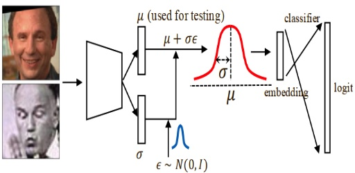
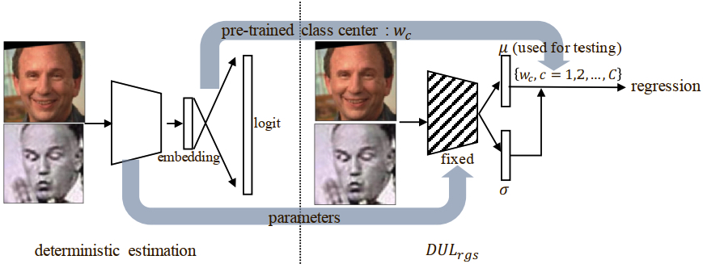

## Notice
This is not the official project of DUL !!!

## Data preprocessing
face detect, face alignment [The corresponding code is not provided in this project, you can find the corresponding code in [insightface](https://github.com/deepinsight/insightface/tree/master/src).]
## Pipeline
The following pictures are taken from the arXiv-paper, if there is a dispute about the permission, please contact me to delete!
<table style="border:0px">
   <tr>
       <td></td>
       <td></td>
</table>

## Citation
```
@misc{chang2020data,
    title={Data Uncertainty Learning in Face Recognition},
    author={Jie Chang and Zhonghao Lan and Changmao Cheng and Yichen Wei},
    year={2020},
    eprint={2003.11339},
    archivePrefix={arXiv},
    primaryClass={cs.CV}
}
```
